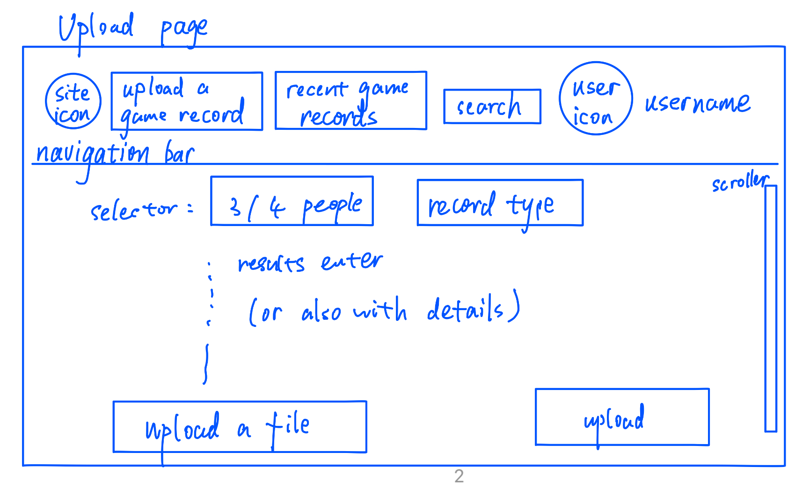
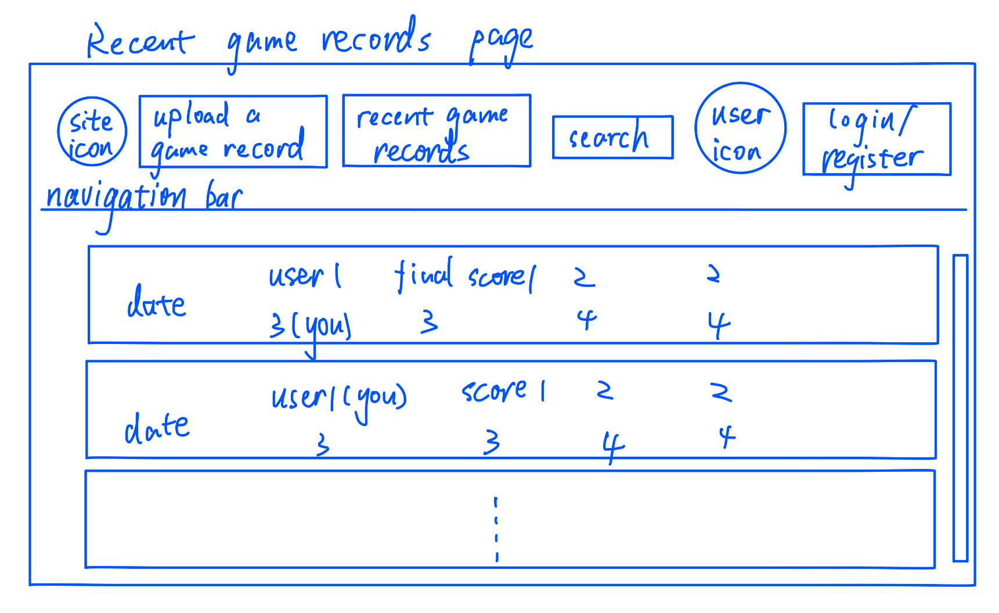

# Proposal

* Team: Jiacong Li
* Project goal: An interactive Japanese Mahjong score management website. Everyone could create an account to store his/her. Users will be able to view their past game histories, as well as perform statistical analysis on their matches.
* User stories:
   * As a normal user: User can add a simple or detailed game records, could view statistics about recent records. User could also update/delete any records of his/her.
   * As a tournament organizer: Organizer can create multiple users' id and add them into the data of the tournament. Organizer can create/update/delete any of the game records which belongs to the tournament he created.
   * As a website developer: Could manipulate all the data.

* UI design

  * Login page 
  * Main page 
  * Upload page 
  * Recent game records page 

* Project requirements

  * Are you proposing a full-stack application?  Yes

  * How will your app use data, including information about and/or provided by your users? 

    Use data provided by users.

  * Will your app have authentication? Yes, user need to login his account to browse his game records.

  * Will your app have a REST API? Yes

  * Will your app consume data from a web-accessible API? My app will not consume data from a web-accessible API because all game records are user-generated. Instead, i would allow user to upload a json file as game details and turn it into a sql to store in database. 

  * What technologies will you use, and why? I would use all kinds of knowledge learned from this course, like basic html, css, js, to perform dynamic and interactive front-end website. An node.js as back-end to handle user requests. Besides, I plan to use SQL database to store and manage data.
