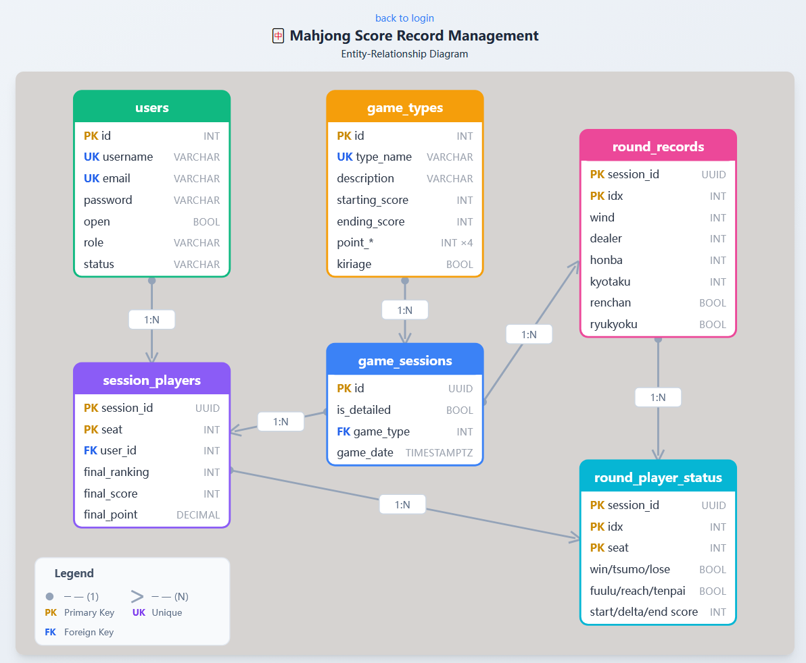
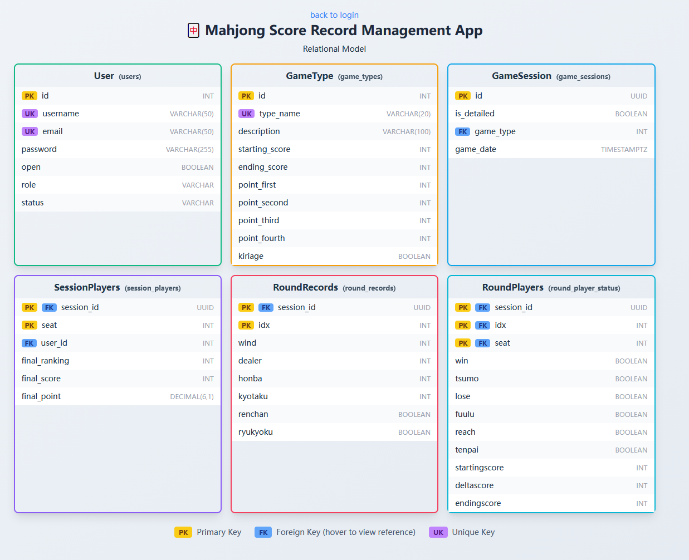

# Report for CS5200

## 1. Readme 

Readme could be find in the repo main page, or [README.md](../README.md).

## 2. Technical Specifications

Front-end:  React + Vite + Tailwindcss. 

​	Further details refer to the [package.json](../my-app/package.json) or can be found at my-app/package.json.

Backend: Nodejs.

Database: Postgresql + Prisma

​	Further details refer to the [package.json](../backend/package.json) or can be found at backend/package.json.

## 3. Design

E-R Diagram and Relational Model can be seen in login page.

 



DDL and DML are at [mahjong_db](../backend/mahjong_db.sql), it could be dumped with dbeaver.

## 4. User flow

Functionalities at front-end are listed in [README.md](../README.md).

At backend server, the functionalities are implemented in `backend/src/controllers/` files.

------

### 1) Authentication Flow

| Action         | Method | Endpoint             | Description                                       |
| -------------- | ------ | -------------------- | ------------------------------------------------- |
| Register       | `POST` | `/api/auth/register` | Create new account with username, email, password |
| Login          | `POST` | `/api/auth/login`    | Authenticate with username/email and password     |
| Get Profile    | `GET`  | `/api/auth/me`       | Retrieve current logged-in user info              |
| Update Profile | `PUT`  | `/api/auth/profile`  | Update username, email, or privacy setting        |

**User Flow:**

```
New User:       Register → Login → Access System
Returning User: Login → Access System
```

------

### 2) Game Session Flow

| Action             | Method | Endpoint                         | Description                                       |
| ------------------ | ------ | -------------------------------- | ------------------------------------------------- |
| Upload Game Record | `POST` | `/api/game-session/upload`       | Submit a new game session with players and rounds |
| Get Session Detail | `GET`  | `/api/game-session/detail?uuid=` | View detailed information of a specific game      |

**User Flow:**

```
After Game:   Select Game Type → Enter Players → Input Scores → (Optional) Add Round Details → Submit
View History: Select Game → View Full Details with Round-by-Round Data
```

------

### 3) User Statistics Flow

| Action              | Method | Endpoint                                                     | Description                                           |
| ------------------- | ------ | ------------------------------------------------------------ | ----------------------------------------------------- |
| Get Game Sessions   | `GET`  | `/api/user/sessions?id=&limit=&ranking=&gametype=&from=&to=` | List user's game history with filters                 |
| Get Round Data      | `GET`  | `/api/user/rounds?id=&limit=`                                | Get detailed round-level statistics                   |
| Get Statistics Grid | `GET`  | `/api/user/:id/datagrid`                                     | Get aggregated statistics (win rate, lose rate, etc.) |
| Search Users        | `GET`  | `/api/user/search?q=&id=`                                    | Search for users by username                          |
| Get User by ID      | `GET`  | `/api/user/:id`                                              | Get user profile information                          |
| Compare Points      | `GET`  | `/api/user/compare?id1=&id2=`                                | Head-to-head comparison between two players           |

**User Flow:**

```
View Own Stats:  Dashboard → View Statistics Grid → Filter by Date/Game Type
Compare Players: Search User → Select Competitor → View Head-to-Head Record
Browse History:  View Sessions List → Apply Filters → Click Session for Details
```

------

### 4) Game Type Flow

| Action          | Method | Endpoint                    | Description                              |
| --------------- | ------ | --------------------------- | ---------------------------------------- |
| Get Game Types  | `GET`  | `/api/game-type/list`       | List all available game rule sets        |
| Get Type Detail | `GET`  | `/api/game-type/detail?id=` | Get scoring rules for specific game type |

------

### 5) Admin Flow

| Action              | Method   | Endpoint                      | Description                       |
| ------------------- | -------- | ----------------------------- | --------------------------------- |
| Get All Users       | `GET`    | `/api/admin/users`            | List all registered users         |
| Update User Status  | `PUT`    | `/api/admin/users/:id/status` | Ban or activate user accounts     |
| Delete Game Session | `DELETE` | `/api/admin/sessions/:uuid`   | Remove a game session from system |

**Admin Flow:**

```
User Management:      View All Users → Select User → Change Status (active/banned)
Content Moderation:   View Sessions → Identify Invalid Data → Delete Session
```

------

### Complete User Journey Diagram

```
┌─────────────────────────────────────────────────────────────────┐
│                        GUEST USER                                │
│  ┌──────────┐     ┌──────────┐                                  │
│  │ Register │ ──► │  Login   │                                  │
│  └──────────┘     └────┬─────┘                                  │
└────────────────────────┼────────────────────────────────────────┘
                         ▼
┌─────────────────────────────────────────────────────────────────┐
│                    AUTHENTICATED USER                            │
│                                                                  │
│  ┌─────────────────┐    ┌─────────────────┐    ┌──────────────┐ │
│  │ Upload Game     │    │ View Statistics │    │ Search Users │ │
│  │ Session         │    │ & History       │    │ & Compare    │ │
│  └────────┬────────┘    └────────┬────────┘    └──────┬───────┘ │
│           │                      │                     │         │
│           ▼                      ▼                     ▼         │
│  ┌─────────────────┐    ┌─────────────────┐    ┌──────────────┐ │
│  │ Add Round       │    │ View Session    │    │ Head-to-Head │ │
│  │ Details         │    │ Details         │    │ Comparison   │ │
│  └─────────────────┘    └─────────────────┘    └──────────────┘ │
│                                                                  │
│  ┌─────────────────┐                                            │
│  │ Update Profile  │                                            │
│  └─────────────────┘                                            │
└─────────────────────────────────────────────────────────────────┘
                         │
                         ▼ (if role = admin)
┌─────────────────────────────────────────────────────────────────┐
│                      ADMIN USER                                  │
│  ┌─────────────────┐    ┌─────────────────┐                     │
│  │ Manage Users    │    │ Delete Sessions │                     │
│  │ (ban/activate)  │    │                 │                     │
│  └─────────────────┘    └─────────────────┘                     │
└─────────────────────────────────────────────────────────────────┘
```

------

### Key Statistics Provided by System

The `getDataGrid` endpoint calculates the following aggregated statistics:

| Statistic            | Description                                     |
| -------------------- | ----------------------------------------------- |
| Total Games          | Number of games played                          |
| Highest Score        | Maximum final score achieved                    |
| Lowest Score         | Minimum final score achieved                    |
| Average Rank         | Average placement (1st-4th)                     |
| Busting Rate         | Percentage of games ending with negative score  |
| Win Rate             | Percentage of rounds won                        |
| Lose Rate            | Percentage of rounds lost (deal-in)             |
| Tsumo Rate           | Percentage of wins by self-draw                 |
| Draw Tenpai Rate     | Tenpai rate at exhaustive draw                  |
| Exhaustive Draw Rate | Percentage of rounds ending in draw             |
| Fuulu Rate           | Percentage of rounds with open hand             |
| Reach Rate           | Percentage of rounds declaring riichi           |
| Dama Rate            | Percentage of wins with closed hand (no riichi) |
| Average Win Score    | Average points gained when winning              |
| Average Lose Score   | Average points lost when dealing in             |

## 5. Lesson Learned

### a. Technical Expertise Gained

**Advanced SQL Queries**

Used Common Table Expressions (CTEs) extensively for complex statistical calculations, improving query readability. Learned PostgreSQL-specific `FILTER` clause for conditional aggregation and `NULLIF` to prevent division by zero:

```sql
WITH round_stats AS (...),
     session_agg AS (...),
     round_agg AS (...)
SELECT 
  count(*) FILTER (WHERE win)::float / count(*) AS Win_Rate,
  count(*) FILTER (WHERE tsumo)::float / NULLIF(count(*) FILTER (WHERE win), 0) AS Tsumo_Rate
FROM round_stats;
```

**ORM Integration (Prisma)**

Learned to map complex database relationships to Prisma schema. Used `prisma.$queryRaw` for analytical queries difficult to express in ORM syntax, and `prisma.$transaction` for atomic operations across multiple tables.

------

### b. Insights

- **Data Domain**: Mahjong scoring requires tracking multiple states per player per round (win, tsumo, lose, reach, fuulu, tenpai), leading to a wide table design for `round_player_status`.
- **Time Management**: Spending adequate time on initial schema design saved significant refactoring time later. Changes to primary keys after data insertion proved costly.
- **Performance**: Added indexes on `session_players.user_id` and `game_sessions.game_date` after using `EXPLAIN ANALYZE` to identify slow queries.

------

### c. Alternative Design Approaches

**Considered: Denormalized Statistics Table**

Current design calculates statistics on-the-fly using complex CTEs. An alternative would be a pre-computed `user_statistics` table updated via triggers:

```sql
CREATE TABLE user_statistics (
    user_id INTEGER PRIMARY KEY REFERENCES users(id),
    total_games INTEGER,
    win_rate DECIMAL(5,4),
    average_rank DECIMAL(3,2),
    last_updated TIMESTAMPTZ
);
```

Trade-off: Faster reads but added complexity for maintaining consistency. Not implemented due to time constraints.

------

### d. Known Issues

**Prisma Raw Query Type Casting**

PostgreSQL aggregate functions return `BIGINT` or `NUMERIC` types, which Prisma serializes as strings instead of numbers in JavaScript:

```sql
-- Returns string "0.65" instead of number 0.65
avg(final_ranking)::float AS Average_Rank
```

Workaround: Manual type conversion in application layer.

### e. Future Work

**Planned Uses**

- Serve as the backend database for a Mahjong club management system, tracking member performance and game history over multiple seasons.

**Potential Added Functionality**

- **Materialized Views**: Create pre-computed statistics views refreshed periodically to improve query performance for the `getDataGrid` endpoint.
- **Ranking System**: Add a `user_rankings` table with ELO/Glicko rating calculations based on game results.
- **Audit Logging**: Implement a `game_sessions_audit` table using triggers to track modifications and deletions for data integrity.